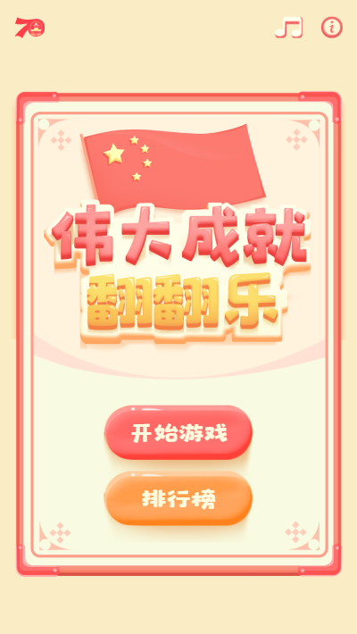
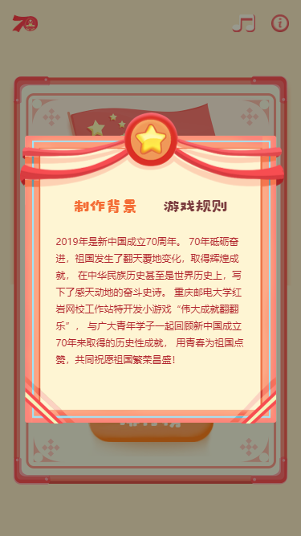
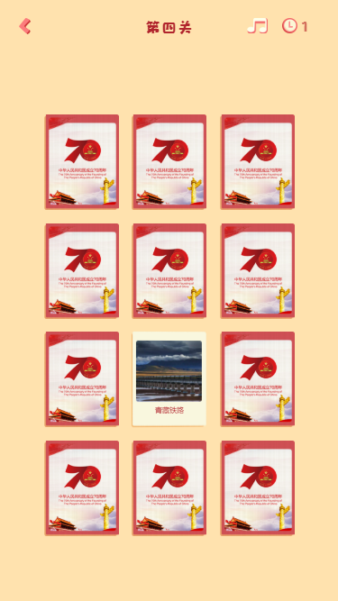
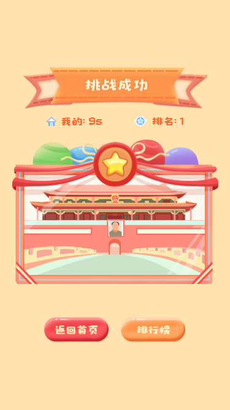
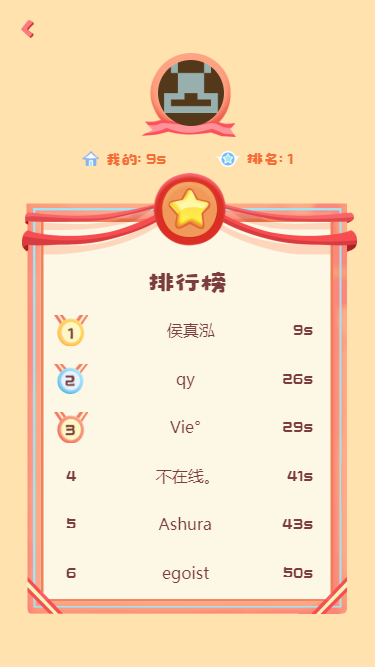
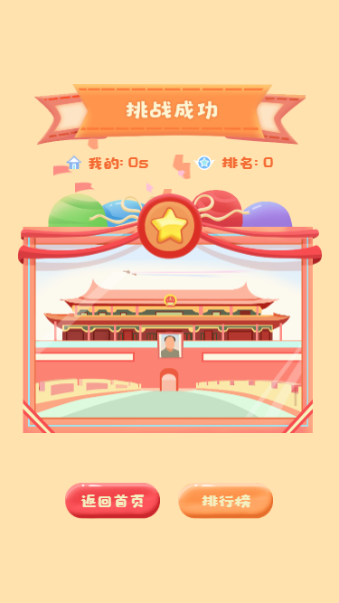

### 整体结构

为了方便只展示 src 目录下的文件

```
├─assets            // 静态资源文件存放图片和字体文件
│  ├─font				// 字体文件 https://www.lcddjm.com/font 提取所需要的字
│  ├─image				// 图片 https://tinypng.com 压缩
|  ...
├─component       	// 每个页面所需要的组件
│  ├─Base*** 			// 基础组件
│  ├─Index*** 			// 首页所需的组件
│  └─Section*** 		// 关卡页面所需的组件     
|  ...
├─interface         // ts 所用的接口
├─pages             // 页面文件
│  ├─Choose				// 选择关卡
│  ├─Index				// 首页
│  ├─RankList			// 排行榜
│  ├─Section			// 每个关卡
│  ├─Success			// 挑战成功
└─utils              // 工具函数
    ├─convertFloatToInt	// 将浮点数转换成 10 进制数
    ├─convertNumberToUppercase // 将阿拉伯数字转换成中文数字(只个位)
    ├─convertPxToVw		// 将 px 转换成 vw (只用于牌数据，其他使用库来做)
    ├─sortCard			// 打乱牌顺序
    ├─useFetch			// 将所有请求包装成 custom hooks
    ├─useInterval		// 将 setInterval 包装成 custom hooks
    └─useTimeout		// 将 setTimeout 包装成 custom hooks
    
```

## 技术栈

- React
- react-router-dom  	// 路由
- use-react-router        // 通过 hooks 的方式获取到 react-router 的 context
- react-spring 		       // 动画
- styled-components   // CSS-in-JS
- styled-normalize       // 重置默认 CSS 样式
- styled-px2vw 			 // px to vw
- react-id-swiper           // 让 swiper 更适合 react
- swiper                          // 触摸内容滑动 js 插件


## 项目运行

使用 [Create React App](https://github.com/facebook/create-react-app) 创建，按照标准即可完成

## 注意点

1. 移动端 click 300 ms 延迟

   因为本项目对于点击响应速度有要求，但是使用 touch** 的方式会导致点击穿透，故使用

   ```html
   <meta name="viewport" content="user-scalable=no">
   <meta name="viewport" content="initial-scale=1,maximum-scale=1">
   ```

   禁止放大缩小

2. 点击会有高亮

   覆盖 webkit/safari, Blink/Chrome 几乎所有的移动浏览器

   ```css
   -webkit-tap-highlight-color: rgba(0, 0, 0, 0);
   ```


## 特别的一些地方

- 使用 hooks 拿到 router 的 context

  ```js
    const {
      match: { params },
    } = useRouter<ISectionRouterProp>();
    const { step } = params;
    const [stepNum] = useState(Number(step));
  ```
  
- 使用自定义 hooks 处理数据

  - initialData 从后端拿到的数据的大体格式，这样就不需要自己写 interface 了，还解决了，没有拿到数据然后渲染出错的问题
  - postData 因为本项目只有 get 和 post 所以直接以是否有该来进行判断

  ```js
  // src/utils/useFetch.ts
  function useFetch<T>(initialUrl: string, initialData: T, postData?: any) {
    const [data, setData] = useState(initialData);
    const [url, setUrl] = useState(initialUrl);
    const [isLoading, setIsLoading] = useState(false);
    const [isError, setIsError] = useState(false);
    const didCancel = useRef<boolean>();
    useEffect(() => {
      didCancel.current = false;
      const fetchData = async () => {
        setIsError(false);
        setIsLoading(true);
        try {
          let body;
          if (postData) {
            const formBody = [];
            for (const property in postData) {
              const encodedKey = encodeURIComponent(property);
              const encodedValue = encodeURIComponent(postData[property]);
              formBody.push(`${encodedKey}=${encodedValue}`);
            }
            body = formBody.join('&');
          }
          const result = await fetch(`${process.env.REACT_APP_BE_URL}${url}`, {
            method: postData ? 'POST' : 'GET',
            body: postData ? body : null,
            headers: {
              'content-type': 'application/x-www-form-urlencoded',
              token: localStorage.getItem('id_token') || '',
            },
          });
  
          if (!didCancel.current) {
            result.json().then(a => setData(a));
          }
        } catch (error) {
          if (!didCancel.current) {
            setIsError(true);
          }
        }
  
        setIsLoading(false);
      };
      fetchData();
  
      return () => {
        didCancel.current = true;
      };
    }, [url]);
  
    const doFetch = (_url: string) => {
      setUrl(_url);
    };
  
    return {
      data,
      isLoading,
      isError,
      doFetch,
    };
  }
  ```


- 翻牌逻辑

  - 将牌的大小数据以及两牌之间的距离记录到一个数组中，以方便修改以及调用

    ```js
    // src/data/card.ts
    const cardsSize = convertPxToVw([
      {
        width: 282,
        height: 359,
        marginRight: 17,
        marginBottom: 18,
        imageHeight: 232,
        imageWidth: 245,
        fontSize: 24,
      },
      ...
    ]);
    
    ```

  ```js
  // src/component/SectionCard.tsx
  ...
    // 初始化牌的数据 
    const [cardData, setCardData] = useState(
      sortCard(cardDatas[stepNum - 1]).map((item, index) => ({
        ...item,
        isShow: false, // 是否翻开
        isHide: false, // 是否已经成功比对消失了
        id: index,
      })),
    );
    // 如上将牌的大小信息拿到
    const [cardSize] = useState(cardsSize[stepNum - 1]);
    const handelCardClick = (index: number) => {
      if (cardData[index].isHide) return; // 如果隐藏了就不执行了
      // 先查询上一次的 -> 是否已经有两张已经翻开了
      const temp = cardData.filter(item => item.isShow && !item.isHide);
      // 如果有两张已经翻开 不能新翻开牌
      if (temp.length !== 2 || cardData[index].isShow) {
        // 将牌的状态调转
        cardData[index].isShow = !cardData[index].isShow;
        // 设定新的 state
        setCardData([...cardData]);
        // 查找调整过后翻开的的牌
        const isShowCard = cardData.filter(item => item.isShow && !item.isHide);
        // 如果当前是新翻开的牌的情况 并且牌的数量为 2 检查是否满足消灭的条件
        if (cardData[index].isShow && isShowCard.length === 2) {
          if (isShowCard[0].content === isShowCard[1].content) {
            // 将牌的状态调转
            cardData[isShowCard[0].id].isHide = true;
            cardData[isShowCard[1].id].isHide = true;
            // 设定新的 state
            setCardData([...cardData]);
            // 在这种情况下查看是否还有牌没有隐藏
            // 如果没有那么就触发时间暂停
            if (!cardData.some(item => !item.isHide)) {
              const cardFinished = new Event('cardFinished');
              window.dispatchEvent(cardFinished);
              setShowMask(true);
            }
          } else {
            // 如果不满足条件，自己翻回去
            setTimeoutRef.current = setTimeout(() => {
              cardData[isShowCard[0].id].isShow = false;
              cardData[isShowCard[1].id].isShow = false;
              setCardData([...cardData]);
            }, 500);
          }
        }
      }
    };
  ...
  ```

- 组件间传递信息

  因为比较简单没有引入 redux 直接使用原生的自定义事件，并将数据存储在 localstorage 中
  
- 成功页面的彩带飞落

  参考 https://github.com/cahilfoley/react-snowfall 做了些修改


  - 使用 http://demo.qunee.com/svg2canvas/ (canvg.js) 将 svg 转换成 bezier Curve 

    ```js
    // src/snowfall/hooks.ts
       	ctx.moveTo(-0.012, 15.45);
        ctx.bezierCurveTo(-0.012, 15.45, -0.196, 25.764, 7.897, 24.97);
        ctx.bezierCurveTo(7.3, 25.054, 13.975, 9.882, 25.979, 3.028);
        ctx.bezierCurveTo(24.911, 2.685, 20.704, 5.048, 20.859, 0.802);
        ctx.bezierCurveTo(21.013, -3.443, 4.371, 9.818, -0.012, 15.45);
        ctx.closePath();
    ```

  - 然后使用 drawImage 将生成的 canvas 放到主要的 canvas 里

    ```js
    ctx.drawImage(this.image, this.params.x, this.params.y);
    ```


  ## 更新日志

  本项目遵从 [Angular Style Commit Message Conventions](https://gist.github.com/stephenparish/9941e89d80e2bc58a153)，更新日志由 `standard-changelog` 自动生成。完整日志请点击 [CHANGELOG.md](./CHANGELOG.md)

## 图例












